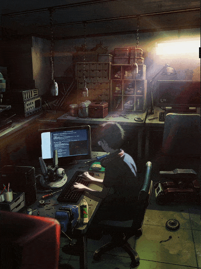

<table align="center">
  <tr>
    <td>
      <a href="README.md">🇧🇷 Português</a>
    </td>
    <td>
      <b>
        <a href="readme-en.md">🇺🇸 English</a>
      </b>
    </td>
  </tr>
</table>
<h2 align="center">🕵ï¸â€â™‚ï¸ &ensp;<i>ğšƒğš˜ğšğšŠğš• ğšğš ğš…ğš’ğšœğš’ğšğšŠğšœ ğš—𚘠ğš™ğšğš›ğšğš’ğš•</i></h2>  
 
 
   
 

  

          

<h2 align="center">📇 &ensp; <i>Ｓｏｂｒｅ</i></h2>

   

<ul align="left">
Atualmente, estou mergulhado no mundo do desenvolvimento de software, trabalhando com tecnologias como React, PHP/Laravel, Node.js e TypeScript. Paralelamente, estou dedicado a aprimorar minha base de conhecimento e habilidades, cursando o bacharelado em Sistemas de Informação.
</ul>
    
<h2 align="center">🛠️ &ensp; <i>Ｔｅｃｎｏｌｏｇｉａｓ</i></h2>

<table align="right" height="267px">
  <tr>
  </td>
        <td align="center">
       
      
        <b>
          <pre>HTML5</pre>
        </b>
      
    </td>
    <td align="center">
       
      
        <b>
          <pre>CSS3</pre>
        </b>
      
      </td>
      <td align="center">
       
      
        <b>
          <pre>Javascript</pre>
        </b>
      
    </td>
       <td align="center">
       
      
        <b>
          <pre>Typescript</pre>
        </b>
      
  </tr>
  <tr>
    <td align="center">
       
      
        <b>
          <pre>ReactJS</pre>
        </b>
      
    </td>
    <td align="center">
       
      
        <b>
          <pre>NextJS</pre>
        </b>
      
    </td>
    <td align="center">
       
      
        <b>
          <pre>ViteJS</pre>
        </b>
      
    </td>
    <td align="center">
       
      
        <b>
          <pre>Bootstrap</pre>
        </b>
      
    </td>
  </tr>
    <tr>
      <td align="center">
       
      
        <b>
          <pre>React Native</pre>
        </b>
      
    </td>
    <td align="center">
       
      
        <b>
          <pre>&ensp;Axios&ensp;</pre>
        </b>
      
    </td>
    <td align="center">
       
      
        <b>
          <pre>NodeJS</pre>
        </b>
      
    </td>
       <td align="center">
       
      
        <b>
          <pre>Express</pre>
        </b>
      
    </td>
  </tr>
 
</table>
             

<h2 align="center">📩 &ensp; <i>Ｃｏｎｔａｔｏ</i></h2>

  

<!--    -->
  
  
   
  
  	

  

<h2 align="center">🗃️ &ensp; <i>Ｐｒｏｊｅｔｏｓ</i></h2>

<table height="495px">
  <tr>
    <td>
    
    </td>
  </tr>
  <tr>
    <td>
    
    </td>
  </tr>
  <tr>
    <td>
    
    </td>
  </tr>
  <tr>
    <td>
     
    </td>
  </tr>
  <tr>
    <td>
    
    </td>
  </tr>
</table>
 

<h2 align="center">

📈 &ensp; <i>Ａｔｉｖｉｄａｄｅ</i>

 

  

 

 
  
  

  
 

